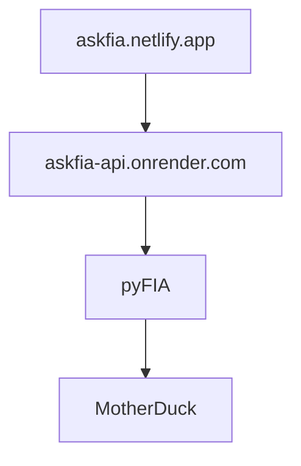

<div align="center">
  <a href="https://fiatools.org"></a>

  <p><strong>Ask questions, get forest answers</strong></p>

  <p>
    <a href="https://fiatools.org"></a>
    <a href="https://askfia.netlify.app"></a>
    <a href="https://opensource.org/licenses/MIT"></a>
    <a href="https://www.python.org/downloads/"></a>
  </p>

  <p>
    <strong>Part of the <a href="https://fiatools.org">FIAtools Python Ecosystem</a></strong><br>
    <a href="https://fiatools.org">pyFIA</a> ·
    <a href="https://fiatools.org">gridFIA</a> ·
    <a href="https://fiatools.org">pyFVS</a> ·
    <a href="https://fiatools.org">askFIA</a>
  </p>
</div>

---

A conversational AI interface for forest inventory data. Ask natural language questions about USDA Forest Service FIA data and get instant answers.

## What can you ask?

```
"How much timber volume is in North Carolina?"

"Compare loblolly pine biomass between Georgia and Alabama"

"What are the top species by basal area in Oregon?"

"How has forest area changed in the Southeast?"

"Show me mortality trends in the Pacific Northwest"
```

## Try It

Visit **[askfia.netlify.app](https://askfia.netlify.app)** to start asking questions.

## Features

| Capability | Description |
|------------|-------------|
| **Natural language** | Ask questions in plain English |
| **Conversational** | Follow-up questions with context |
| **Streaming** | Real-time response streaming |
| **FIA data access** | Queries USDA Forest Service inventory data |

## Architecture



## API Usage

The backend API is available at `https://askfia-api.onrender.com`.

### Streaming Chat

```bash
curl -X POST https://askfia-api.onrender.com/api/v1/chat/stream \
  -H "Content-Type: application/json" \
  -d '{"message": "What is the total forest area in Oregon?"}'
```

### Direct Queries

```bash
# Forest area
curl -X POST https://askfia-api.onrender.com/api/v1/query/area \
  -H "Content-Type: application/json" \
  -d '{"state": "OR"}'

# Timber volume
curl -X POST https://askfia-api.onrender.com/api/v1/query/volume \
  -H "Content-Type: application/json" \
  -d '{"state": "NC", "species": "loblolly pine"}'

# Biomass
curl -X POST https://askfia-api.onrender.com/api/v1/query/biomass \
  -H "Content-Type: application/json" \
  -d '{"state": "GA"}'
```

### Health Check

```bash
curl https://askfia-api.onrender.com/health
```

## Local Development

```bash
# Clone the repository
git clone https://github.com/mihiarc/askfia.git
cd askfia

# Install dependencies
make install

# Run frontend and backend together
make dev

# Or run separately:
cd backend && uv run uvicorn askfia_api.main:app --reload
cd frontend && npm run dev
```

### Environment Variables

**Backend** (`backend/.env`):
```
ANTHROPIC_API_KEY=your-api-key
MOTHERDUCK_TOKEN=your-token
CORS_ORIGINS=http://localhost:3000
```

**Frontend** (`frontend/.env.local`):
```
NEXT_PUBLIC_API_URL=http://localhost:8000
```

## Tech Stack

| Layer | Technology |
|-------|------------|
| **Frontend** | Next.js 15, React 19, Tailwind CSS, shadcn/ui, Vercel AI SDK |
| **Backend** | FastAPI, Pydantic v2, LangChain, Claude API |
| **Data** | pyFIA, DuckDB, Polars, MotherDuck |
| **Deployment** | Netlify (frontend), Render (backend), MotherDuck (data) |

## Coming Soon

- [ ] Custom reports
- [ ] Data downloads
- [ ] Custom analysis templates

## The FIAtools Ecosystem

askFIA is part of the [FIAtools Python ecosystem](https://fiatools.org) - a unified suite of open-source tools for forest inventory analysis:

| Tool | Purpose | Key Features |
|------|---------|--------------|
| [**pyFIA**](https://fiatools.org) | Survey & plot data | DuckDB backend, 10-100x faster than EVALIDator |
| [**gridFIA**](https://fiatools.org) | Spatial raster analysis | 327 species at 30m resolution, Zarr storage |
| [**pyFVS**](https://fiatools.org) | Growth simulation | Chapman-Richards curves, yield projections |
| [**askFIA**](https://fiatools.org) | AI interface | Natural language queries for forest data |

**[Explore the full ecosystem at fiatools.org](https://fiatools.org)**

## Citation

```bibtex
@software{askfia2025,
  title = {askFIA: Conversational AI Interface for Forest Inventory Data},
  author = {Mihiar, Christopher},
  year = {2025},
  url = {https://fiatools.org}
}
```

---

<div align="center">
  <a href="https://fiatools.org"><strong>fiatools.org</strong></a> · Python Ecosystem for Forest Inventory Analysis<br>
  <sub>Built by <a href="https://github.com/mihiarc">Chris Mihiar</a> · USDA Forest Service Southern Research Station</sub>
</div>
